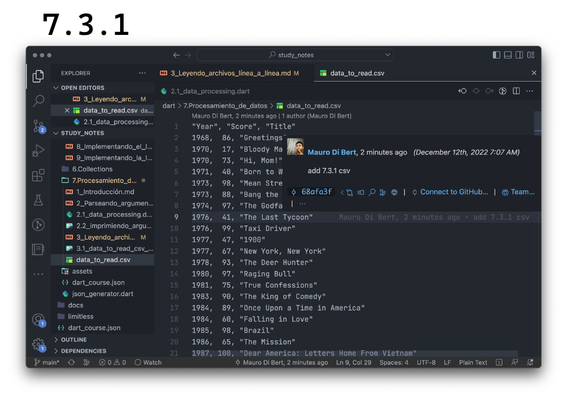

# Reading files line by line

For this exercise, we will use a file that shows all of Robert DeNiro's movies, with the year of each movie, the title and rating.

1. Go to [this link](https://github.com/themonkslab/courses/blob/main/dart/7.Procesamiento_de_datos/data_to_read.csv). There you will see a preview of the file, how it would look tabulated.
2. Click where it says _raw_.
3. Copy all the content.
4. Create a new file in the directory where you are working, with name `data_to_read.csv`
5. Paste the content in this file.
6. Save it.

You should see something like this: .

## Reading the file by lines

Now that we saved our file, we are going to try to read its content. To do so, we will create a reference to our file with the `File` class, providing it with the file we entered as an argument to read it line by line with the `readAsLinesSync` command, which will return a list of lines. Finally, we are going to store everything in a variable called `contentInLines` and we are going to print it to see how it turns out:

```dart
import 'dart:io';

void main(List<String> arguments) {
  if (arguments.isEmpty) {
    print('Usage: dart data_processing.dart <inputFile.csv>');
    exit(1);
  }
  final inputFile = arguments.first;
  final contentInLines = File(inputFile).readAsLinesSync();
  for (var line in contentInLines) {
    print(line);
  }
}
```

How cool! We can now read a file that we pass to our program and all by command line! Tell me if you don't feel like Neo in the first Matrix! 😄

In this case, we know that we are going to upload a file that we have, we know its name, and so on. 💀 __What would happen however, if we enter the name of a file that does not exist?__ You know what to do! Go try it and break it! 🤣


These errors, at first, can be very scary! 🧟‍♂️ But if we take it calmly and try to understand it line by line, the thing changes, because although we will not always understand each line, it is enough with those that lead us to the solution of our error. Ah! __Important: always start reading errors from the first line, from top to bottom and from left to right__:


Here we can see the _stack trace_ of our error, one above the other, __from the last manifestation of the bug to the process that caused it__.

First we get a `FileSystemException`. Then it tells us that it cannot open the file and gives us the path of the file. And finally it tells us that this file or directory is not found. That should be enough to understand why it failed!

In addition, in step #5, it then tells us in which file the error occurred, including line (9) and column (42). If you do `cmd/ctrl + click` on that file, it will direct you to exactly where the error occurred. Very useful, isn't it?

It would be correct to write our defensive code, expecting that an error may happen, however we lack knowledge of futures and asynchronous code, so we will do it in... the future! 😂
