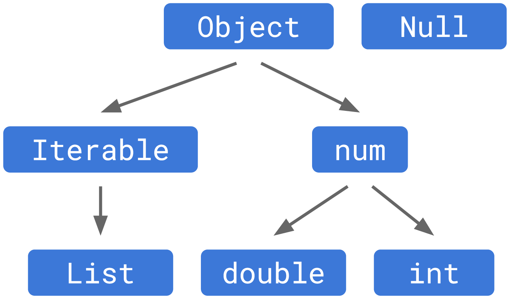

# Hierarchies

I will try to tell you about it in a simple way because there are still some things that we did not see; I hope that by reading it calmly you will understand. If not, you can always join [our Discord](https://discord.gg/vpPVf7guPC)  and ask questions until you understand! 🤓

The graphic from the [documentation on null safety in Dart](https://dart.dev/null-safety/understanding-null-safety), shows what the type hierarchy was like before _null safety_ was included:


Here we can see a simplification where all types were childs of the `Object` type (you didn't see `Iterable` and `num` yet but basically they are parents of `List` and, `double` and `int` as seen in the graphic). Underneath it all, there was the `Null` type.

But what does it mean that they are parents and childs? We will see inheritance soon, but simply __childs have the possibility to do what their parent does__.

Suppose we meet Superman with his son and Batman with his son: Superman's son inherits the ability to fly, shoot lightning with his eyes and his marked reluctance to kryptonite. While Batman's son inherits only fortunes! 🤣

__The set of operations that are allowed in some expressions are defined by their type.__ I repeat because this is very important: The set of operations that are allowed in some expressions are defined by their type. If the type is a `List`, we can call `.add()` as we already saw, or if it is `int` we can use the `+`, but the `null value`, does not have any of those methods. So why can we print it? Because of the only three methods it has, one is `toString()`, which allows it to be displayed as if it were a text string.

If we were to allow the null value to move through types other than its own, it will fail. And this is __the key to all _null safety_: every failure comes from trying to access a method or property that `null` does not contain.__

How did _null safety_ to fix this ? By changing the hierarchy.

## New hierarchy since _null safety_

__Now the `Null` _type_ exists but is no longer a child of all previous types__.



And since it is no longer a child or subtype, the `Null` class allows a `null` value and __the rest of the types are non-nullable by default,__ explaining what we saw before.

Thus, a value can flow from being null to non-null according to the _static check_ or as we define it explicitly. In this way, we ensure forever and ever, never ever, to have errors due to null values! 😅 Well, it is not quite true since we will have them but at least we will have had from our dear Dart, all the necessary help so that this could have been avoided! 😂

## The previous problem

Remember the exercise? Why does it print the null value? And why can you use the `toUpperCase()` method on a `String?`?

```dart
void main() {
  const hardware = <String?>['Mouse', 'Keyboard', null];
  for (var hardwarePiece in hardware) {
    print(hardwarePiece?.toUpperCase());
  }
}
```

Here we already answered half in the previous paragraphs: it prints the null value because it does have within its only three methods, one called `toString()` that allows us to pass to text string its value and therefore print it.

In the other half, why does it allow us to access the `toUpperCase()` method? Dart made the nullable type, in this case the `String?`, a parent of the `String` and `Null` types so that it can receive both forms. In our example, the _static check_ knows that the value is a `String` and that is what the parent receives so it can apply its methods, in this case the `toUpperCase()`.

In this way, the hierarchy would be something like this, having underneath all, a class `Never` that we will not see for now and allows to stop the execution of the application and to throw an exception.


