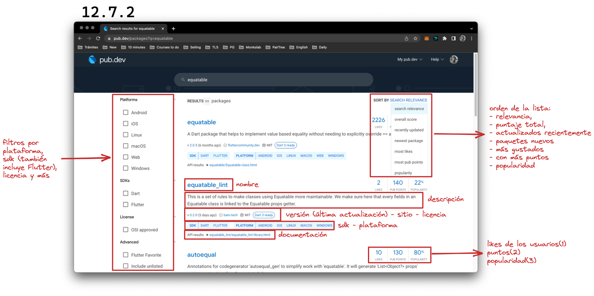

# Heredando de _Object_

Como lo mencionamos cuando hablamos de jerarquías en el capítulo sobre _Null
safety_ ([Jerarquías](../8.Null_safety/4_jerarqu%C3%ADas.md)), __todas las clases
creadas y las que creemos, por defecto, son hijas de `Object?`, por lo que vamos
a poder hacer uso de sus métodos__, que no son muchos pero son de mucha utilidad.

## toString()

Vamos a seguir con el ejemplo de `implement_extends`. Vayan al archivo
`implement_extends_example.dart`, comenten todo salvo la inicialización de
`transaction1` y prueben imprimir dicha variable. Qué es lo
que verían?

```dart
import 'package:implement_extends/implement_extends.dart';

void main() {
  final transaction1 = Transaction(
    id: 1,
    fullName: 'John Doe',
    paymentType: CashPayment(
      id: 1,
      amount: 1000.0,
      isTaxable: false,
    ),
  );

  print(transaction1);
}
```

```shell
Instance of 'Transaction'
Exited
```

Desarmemos esto un poco con algunas preguntas, les parece?

Primero, por qué puedo imprimir una clase cualquiera? Pueden pararse encima de
nuestro método `print` y van a ver que lo que recibe es un `Object?`, por lo que
podemos pasarle cualquier cosa que `print` va a saber qué hacer. Y qué es lo que hace?

Dijimos que todas las
clases heredan de la clase `Object?` y si ponemos un `.` luego de `transaction1`
para ver qué métodos y propiedades tiene, podemos observar uno que no definimos
nosotros: `toString()`.

Este método es el que por defecto retorna 'Instance of `Transaction`'. Sin
embargo podríamos sobreescribirlo para que nos diga algo más útil:

```dart
class Transaction {
  Transaction({
    required this.id,
    required this.fullName,
    required this.paymentType,
  });

  int id;
  String fullName;
  PaymentType paymentType;

  void processTransaction() {
    final type = paymentType.processPayment();
    print('This transaction was processed by $type');
  }

  @override
  String toString() {
    return 'Transaction{id: $id, fullName: $fullName, paymentType: $paymentType}';
  }
}
```

Y ahora cuando imprimen:

```shell
Transaction{id: 1, fullName: John Doe, paymentType: Instance of 'CashPayment'}
Exited
```

Sin embargo, fíjense qué sucede con `paymentType`. 💀 Parece que les va a tocar
el trabajito de ir a hacerlo ustedes! 🤣

Listo?

```dart
class CashPayment implements PaymentType, PaymentExtras {
  CashPayment({
    required this.id,
    required this.amount,
    required this.isTaxable,
  });

  @override
  final int id;
  @override
  final double amount;
  @override
  final bool isTaxable;

  @override
  String processPayment() {
    print('Paid amount: $amount. Taxable: $isTaxable');
    return 'CashPayment';
  }

  @override
  String toString() {
    return 'CashPayment{id: $id, amount: $amount, isTaxable: $isTaxable}';
  }
}
```

```shell
Transaction{id: 1, fullName: John Doe, paymentType: CashPayment{id: 1, amount: 1000.0, isTaxable: false}}
Exited
```

Ahora sí!

## _Equality operator_

Quiero que probemos una cosa: en su `implements_extends_example.dart`, prueben
poner una _assertion_ que les permita afirmar que 1 es igual a 1. 💀 Solo para
que pongan los `assert` en remojo, vayan a probarlo ustedes.

Si escribieron:

```dart
  assert(1 == 1, 'something is wrong!');
```

Y luego corrieron, van a observar que corrió a la perfección ya que
efectivamente 1 es igual a 1. Pero qué sucede si creamos dos transacciones
iguales y las comparamos? 💀 Adelántense!

```dart
void main() {
  final transaction1 = Transaction(
    id: 1,
    fullName: 'John Doe',
    paymentType: CashPayment(
      id: 1,
      amount: 1000.0,
      isTaxable: false,
    ),
  );

  final transaction2 = Transaction(
    id: 1,
    fullName: 'John Doe',
    paymentType: CashPayment(
      id: 1,
      amount: 1000.0,
      isTaxable: false,
    ),
  );

  print(transaction1);
  print(transaction2);

  print(transaction1 == transaction2);
  assert(transaction1 == transaction2, 'They are not equal');
}
```

Como habrán podido observar, nuestra comparación nos da `false` lo que hace que
luego e! Pero cómo? Si son iguales? 💀 Ya que estamos aquí, vayan a escribir un
test para comprobar que efectivamente son iguales.

Les dejo solamente el nuevo código así no les ocupo toda la pantalla! 🤣

```dart
 late Transaction transaction;
    late Transaction transaction1;
    late Transaction transaction2;

    setUp(() {
      transaction = Transaction(
        id: 1,
        fullName: 'John Doe',
        paymentType: CashPayment(id: 1, amount: 1000.0, isTaxable: false),
      );
      transaction1 = Transaction(
        id: 1,
        fullName: 'John Doe',
        paymentType: CashPayment(id: 1, amount: 1000.0, isTaxable: false),
      );
      transaction2 = Transaction(
        id: 1,
        fullName: 'John Doe',
        paymentType: CashPayment(id: 1, amount: 1000.0, isTaxable: false),
      );
    });

    test(
        'When I create two equal transactions, Then each of their fields should be equal',
        () {
      expect(transaction1.id, transaction2.id);
      expect(transaction1.fullName, transaction2.fullName);
      expect(transaction1.paymentType.id, transaction2.paymentType.id);
      expect(transaction1.paymentType.amount, transaction2.paymentType.amount);
    });
```

Cuál entonces es el problema? __Lo que sucede es que Dart no sabe cómo comparar
esta clase que creamos.__ Para ello __tenemos que implementar el operador de
igualdad o _equality operator_.__

Lo hacemos utilizando un _operator overload_ (sobrecarga de operadores) que es una característica de algunos lenguajes de programación orientados a objetos que permite que un operador (como `+`, `-`, `*`, `/`, `==`, entre otros) tenga un comportamiento personalizado en una clase.

En lugar de tener que escribir un método con un nombre específico para realizar una operación, la sobrecarga de operadores permite que se defina un método con el nombre del operador y que se use para realizar la operación correspondiente.

En Dart, se pueden sobrecargar varios operadores, incluyendo `+`, `-`, `*`, `/`,
`%`, `~/`, `<`, `>`, `<=`, `>=`, `==`, `[]`, `[]=`, y `unary-`. Sin embargo, se
recomienda utilizar la sobrecarga de operadores con moderación y de manera
cuidadosa, ya que puede dificultar la legibilidad del código si se utiliza en
exceso o de manera inapropiada.

Vamos a ir por partes para cuidar de entender bien todo. Primero vamos a
sobreescribir el operador con el _operator overload_ así:

```dart
  @override
  bool operator ==() {}
```

Estamos sobreescribiendo el operador para determinar si la clase en la que
estamos implementando el operador (`this`) es la misma a la que la queremos
comparar. Para esto, tiene que recibir dicha clase. Probamos hacerlo?

```dart
  @override
  bool operator ==(Transaction other) {}
```

Si hacemos lo anterior, entre tres errores, el primero en el que quiero que se
concentren es el siguiente: _'Transaction.==' ('bool Function(Transaction)')
isn't a valid override of 'Object.==' ('bool Function(Object)')._ Básicamente
nos dice que no es una sobreescritura válida de `Object.==`, nos dice que espera
un `Object` en lugar de un `Transaction`. Vamos a darle por ahora lo que quiere
y luego volveremos a ver cómo esperar un `Transaction` específicamente:

```dart
  @override
  bool operator ==(Object other) {}
```

Ahora nos muestra dos errores más. Nos concentraremos en el que ya conocen: _The body might complete normally, causing 'null' to be returned, but the return type, 'bool', is a potentially non-nullable type.
Try adding either a return or a throw statement at the end._ Tiene que retornar
algo ya que eso especifica la función: tenemos que devolver un `bool`. Si son
iguales (la clase en la que lo implementamos y aquella con la que la
comparamos), retorna `true` y sino `false`. Podríamos hacer algo así:

```dart
 @override
  bool operator ==(Object other) {
    if (other is Transaction) { // Chequeamos que el `other` sea un Transaction
      return id == other.id &&  // comparamos sus fields
          fullName == other.fullName &&
          paymentType == other.paymentType;
    }
    return false;
  }
```

Nos queda solamente algo más para terminarla y es el aviso de Dart que dice: _Override `hashCode` if overriding `==`.
Implement `hashCode`._ Qué es el `hashCode`? __El `hashCode` es un método de
Dart que devuelve un número entero único para un objeto y se utiliza para
obtener una representación numérica única de un objeto, lo que permite que se
almacene en estructuras de datos como Map y Set. Si no se sobrescribe
`hashCode`, es posible que dos objetos que son iguales según el método `==`
tengan valores de `hashCode` diferentes, lo que puede causar problemas en el
almacenamiento y recuperación de datos en estructuras de datos.

Por lo tanto, siempre se debe sobrescribir `hashCode` cuando se sobrescribe el
método `==.` __Quiero decir que dos objetos iguales, deben tener el mismo `hashCode`__

Cómo lo hacemos?

```dart
@override
  int get hashCode => id.hashCode ^ fullName.hashCode ^ paymentType.hashCode;
```

No se preocupen por la matemática detrás de eso que ni yo la busqué 🤣, pero
básicamente nos basamos en las propiedades de la clase para crear dicho número
único. Y listo! Podríamos ahora hacer la comparación! 💀 Tienen ganas de probar?

🤬 Sigue fallando! Pueden pensar ustedes solitos el porqué? 💀 Escriban un
fundamento de por qué dicha comparación sigue fallando!

Bien! Ahora que hicieron la tarea paso contarles la solución y darles otro
ejercicio con ella. La comparación falla porque uno de sus campos se llama
`paymentType` y su contenido es otra clase nueva a la que tampoco le dijimos
cómo puede compararse! Imaginarán qué es lo que tienen que hacer no? 💀 Vayan a
implementar el operador de sobrecarga y el `hashCode` en `CashPayment`!

Será que lo tienen listo? Espero que sí! Luego de chequear que tengan todo bien,
prueben para ver si ahora deja de fallar!

```dart
class CashPayment implements PaymentType, PaymentExtras {
  CashPayment({
    required this.id,
    required this.amount,
    required this.isTaxable,
  });

  @override
  final int id;
  @override
  final double amount;
  @override
  final bool isTaxable;

  @override
  String processPayment() {
    print('Paid amount: $amount. Taxable: $isTaxable');
    return 'CashPayment';
  }

  @override
  bool operator ==(Object other) {
    if (other is CashPayment) {
      return id == other.id &&
          amount == other.amount &&
          isTaxable == other.isTaxable;
    }
    return false;
  }

  @override
  int get hashCode => id.hashCode ^ amount.hashCode ^ isTaxable.hashCode;

  @override
  String toString() {
    return 'CashPayment{id: $id, amount: $amount, isTaxable: $isTaxable}';
  }
}
```

Genial! Pudimos corroborar que todo funciona a la perfección! Vamos sin embargo,
a hacerle algunas mejoras a esa implementación, sobre todo porque pueden verlo
en algunos códigos y me gustaría entendamos por qué está así implementado.

Podemos verlo así:

```dart
  @override
  bool operator ==(Object other) =>
      identical(this, other) ||
      other is Transaction &&
          runtimeType == other.runtimeType &&
          id == other.id &&
          fullName == other.fullName &&
          paymentType == other.paymentType &&
          hashCode == other.hashCode;
```

Acá encontramos la primer diferencia en la segunda línea de nuestra comparación.

### _Identical_

`identical(this, other)`. Este método chequea si dos referencias son hechas al
mismo objeto. Por ejemplo:

```dart
var object1 = Object();
var object2 = Object();

print(identical(object1,object2));
```

En este caso imprime `false` ya que se trata de objetos diferentes. Qué pasa si
hacemos?

```dart
var object1 = Object();
var object2 = object1;

print(identical(object1,object2));
```

En este caso tendríamos `true` como respuesta ya que se trata de las
referencias.

### _runtimeType_

`runtimeType` es una propiedad en Dart que devuelve el objeto `Type` en tiempo de ejecución. Es decir, en lugar de devolver el tipo declarado en tiempo de compilación, `runtimeType` devuelve el tipo real de un objeto en tiempo de ejecución.

Por ejemplo, supongamos que tenemos una clase `Person`:

```dart
class Person {
  final String name;
  final int age;

  Person(this.name, this.age);
}
```

Luego creamos un objeto `Person` y llamamos a `runtimeType` en él:

```dart
final person = Person('John', 30);
print(person.runtimeType); // Output: Person
```

En este caso, runtimeType devuelve `Person` ya que el tipo real del objeto es
`Person`. Esto es útil cuando necesitamos realizar alguna verificación o
comparación en tiempo de ejecución.

Observen cómo podría ser el caso en el que un `Object` cambie de tipo mientras
estamos ejecutando nuestra app:

```dart
void main() {
  var object = Object();
  print(object.runtimeType); // Imprime 'Object'

  if (DateTime.now().weekday == DateTime.sunday) {
    object = 42; // 🧐 Notaron que en programación este número se utiliza mucho? Vayan a buscar por qué! Pista: 'Douglas Adams'
  } else {
    object = 'hello world';
  }
  print(object.runtimeType); // Imprime 'int' o 'String', dependiendo del día de la semana
}
```

En este caso, `object` se inicializa como un objeto `Object`, por lo que su tipo
en tiempo de ejecución es `Object`. Luego, dependiendo del día de la semana,
`object` se redefine como un `int` o como una `String`, lo que significa que su
tipo en tiempo de ejecución cambiará. Por lo tanto, el segundo `print` mostrará
el tipo de `object` como `int` o `String`, dependiendo del día de la semana en
que se ejecute el código.

### Covariant

Algo que también pueden encontrar y es una nueva mejora al código es utilizar
`covariant`. Es una __palabra clave que se utiliza para indicar que un parámetro
de una clase o una interfaz puede tener un tipo de retorno más específico en una
subclase.__ En otras palabras, si una clase tiene un método que toma un
parámetro de tipo `Object`, una subclase puede declarar que el tipo de retorno
del método es más específico que `Object` utilizando la palabra clave
`covariant` y de esta manera el código nos quedaría así:

```dart
 @override
  bool operator ==(covariant Transaction other) =>
      identical(this, other) ||
      runtimeType == other.runtimeType &&
          id == other.id &&
          fullName == other.fullName &&
          paymentType == other.paymentType &&
          hashCode == other.hashCode;
```

Ya no tenemos que preguntar si `other` es un `Transaction` porque es lo que
solicitamos como parámetro.

### Equatable

Finalmente y ahora que ya aprendieron cómo se implementa, puedo contarles que
existe un paquete que hace todo esto por nosotros y se llama _Equatable_.

Simplemente lo que tienen que hacer es __agregar el paquete para luego poder
utilizarlo.__ Tenemos varias maneras de hacerlo.

La __primer forma__ es agregándolo en nuestro `pubspec.yaml`:

1. Van a la página [Página pub.dev](https://pub.dev/)
2. Buscan el paquete 'Equatable' en la barra.
3. En el listado de resultados, hacen click en ese paquete (en la captura les
   muestro un poquito más sobre pub.dev)
4. Allí pueden recorrer el _Readme_ (Léame en español, lugar donde se suele
   recibir al desarrollador y se explican las cuestiones principales del
   paquete, aplicación o lo que fuera).
5. Hacen click en _Installing_
6. Bajan hasta donde figura el código para agregar al `pubspec.yaml` y lo
   copian: `equatable: ^2.0.5`
7. Vuelven a su código, buscan el archivo `pubspec.yaml` y lo pegan debajo de
   dependencias cuidando la indentación tal y cómo están el resto de ellas.




1. _Likes_: Es la cantidad de veces que un paquete ha sido marcado como "Me
   gusta" por los usuarios de pub.dev. Esto puede indicar que el paquete es
   popular o útil para la comunidad.

2. _Pub points_: Es un sistema de puntos utilizado por pub.dev para medir la
   calidad de los paquetes. Este sistema toma en cuenta una variedad de
   factores, como la compatibilidad de versiones de dependencias, el uso de
   buenas prácticas de codificación, el seguimiento de las convenciones de
   nomenclatura, la disponibilidad de documentación, entre otros aspectos.

3. _Popularity_: Es una medida de la popularidad relativa de un paquete en
   comparación con otros paquetes de pub.dev. Este índice se calcula en función
   de factores como el número de descargas, la cantidad de estrellas en GitHub,
   la cantidad de comentarios y la frecuencia de actualización.


```yaml
name: implement_extends
description: A starting point for Dart libraries or applications.
version: 1.0.0
# homepage: https://www.example.com

environment:
  sdk: '>=2.18.7 <3.0.0'

dependencies:
  equatable: ^2.0.5

dev_dependencies:
  lints: ^2.0.0
  test: ^1.16.0
```

La __segunda forma__, es agregarlo por terminal:

```shell
dart pub add equatable
```

Y la __tercera__ es `cmd/ctrl + shift + p`, escribir 'Dart' y luego seleccionar
donde dice 'Add Dependency' para finalmente entrar 'equatable' y seleccionar.

En cualquiera de ellas luego tendrán que correr el `dart pub get` para
actualizar sus dependencias.

__Una vez instalado__ lo que tenemos que hacer es extender `Equatable` en
nuestra clase:

```dart
class Transaction extends Equatable {
  Transaction({
    required this.id,
    required this.fullName,
    required this.paymentType,
  });

  int id;
  String fullName;
  PaymentType paymentType;

  void processTransaction() {
    final type = paymentType.processPayment();
    print('This transaction was processed by $type');
  }

  @override
  String toString() {
    return 'Transaction{id: $id, fullName: $fullName, paymentType: $paymentType}';
  }
}
```

Lo primero que nos marca es un error que ya solucionaremos pero antes nos
olvidamos de poner nuestros `final` ya que se trata de una clase inmutable (ya
veremos sobre esto) con un error que dice así: _This class (or a class that this
class inherits from) is marked as '@immutable', but one or more of its instance
fields aren't final: Transaction.id, Transaction.fullName, Transaction.paymentType_

Lo solucionamos?:

```dart
class Transaction extends Equatable {
  Transaction({
    required this.id,
    required this.fullName,
    required this.paymentType,
  });

  final int id;
  final String fullName;
  final PaymentType paymentType;

  void processTransaction() {
    final type = paymentType.processPayment();
    print('This transaction was processed by $type');
  }

  @override
  String toString() {
    return 'Transaction{id: $id, fullName: $fullName, paymentType: $paymentType}';
  }
}
```

Y ahora, vemos que el verdadero error es: _Missing concrete implementation of
'getter Equatable.props'._

Resulta que al extender `Equatable` tenemos que implementar esas `props`.
Hacemos `cmd/ctrl + click` y elegimos `Create 1 missing overriding` y nos crea
esta sobreescritura:

```dart
  @override
  // TODO: implement props
  List<Object?> get props => throw UnimplementedError();
```

Allí, simplemente tenemos que devolver un listado con nuestras propiedades y
`Equatable` se encargará de hacer todo por nosotros. Les dejo la clase completa:

```dart
class Transaction extends Equatable {
  Transaction({
    required this.id,
    required this.fullName,
    required this.paymentType,
  });

  final int id;
  final String fullName;
  final PaymentType paymentType;

  void processTransaction() {
    final type = paymentType.processPayment();
    print('This transaction was processed by $type');
  }

  @override
  String toString() {
    return 'Transaction{id: $id, fullName: $fullName, paymentType: $paymentType}';
  }

  @override
  List<Object?> get props => [id, fullName, paymentType];
}
```

<!-- TODO -CONT-: compare simple int with == then compare two equal CashPayment, test -->
