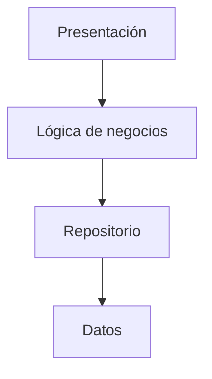
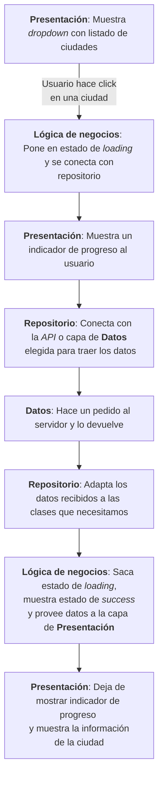

# Introducción a Arquitectura

Supongamos que queremos crear una app que se encarga de pedir un dato por
internet. Estuvimos hablando desde el principio de organización y orden verdad?
Es acaso que en un par de archivos tendremos toda nuestra aplicación? Y será que
tenemos que inventar el cómo hacer toda esta aplicación desde el principio?

Para todo lo anterior, existe la arquitectura de software.

La arquitectura de software __es la estructura y organización de los componentes
de un sistema de software, así como las relaciones y dependencias entre ellos__.
En términos simples, es la forma en que el software está diseñado y organizado
para cumplir con sus requisitos y objetivos.

La importancia de la arquitectura de software radica en que afecta directamente
la calidad y el éxito del mismo. __Una buena arquitectura ayuda a crear un
sistema más eficiente, escalable, fácil de mantener y extensible__. Además,
__permite la detección y corrección temprana de problemas__, __reduce el tiempo
y el costo de desarrollo, y facilita la colaboración y el trabajo en equipo__.

Como estamos por terminar nuestra parte inicial y aprendiendo a interactuar con
el mundo real digital, necesitamos empezar a ordenar la forma en la que
escribimos código y saber que __existen convenciones que nos ayudan a avanzar
mucho más rápido__ en el proceso; hablaremos de dos fundamentales.

## Separación por capas

Algo fundamental es __organizar nuestro código según distintas capas para que
puedan utilizarse como piezas intercambiables__. Es común separar aquello con lo
que el usuario tiene que interactuar (presentación o vista) con la lógica para que
esa vista funcione (lógica de negocio). Luego podemos tener a su vez otra capa
que se encargue de alcanzarle lo necesario a esa lógica, transformándola o
adaptándola (repositorios) y finalmente, la capa que tiene la función de obtener
los datos en bruto y pasárselos a la capa de repositorios (capa de datos).



__Lo interesante__ de la organización en capas es que __separa las diferentes
responsabilidades de la aplicación en partes específicas__ y cohesivas, lo que
hace que sea __más fácil de entender__.

Veamos un ejemplo: tenemos una aplicación que muestra un listado de capitales
del mundo y al hacer click en una de ellas, hace un pedido a un servidor. Éste
responde y dicha respuesta es adaptada a las clases que necesitamos y se acaba
mostrando una serie de datos sobre dicha ciudad.



El que sea más fácil de entender y el que esté estratificado (separado por
capas), __permite que también sea más fácil de mantener ya que si algún error
sucede sabremos de qué capa proviene.__

Por otro lado, __permite una mayor escalabilidad__, lo que significa que la
aplicación puede  __crecer y adaptarse a las necesidades del negocio sin afectar
las otras partes__ de la  aplicación.

Por ejemplo, nuestra gente de _marketing_ podría querer ya no utilizar un
_dropdown_ sino un simple listado, cambio que será muy fácil de realizar debido
a que solamente tenemos que alterar la capa de presentación.

Lo mismo sucedería si nuestros compañeros de _backend_ deciden utilizar otra
_API_ en el proceso de obtención de datos ya que solamente esa capa sería la que
recibiría modificaciones.

Finalmente, separar la aplicación en capas __facilita la colaboración entre
diferentes equipos de desarrollo__, ya que __cada equipo puede trabajar en su propia
capa__ de la aplicación sin interferir en otras capas.

## Patrones de diseño

Los patrones de diseño son __soluciones comunes a problemas recurrentes que se
presentan en el desarrollo__. En general, los patrones de diseño se dividen en
tres categorías: creacionales, estructurales y de comportamiento y hemos visto
ejemplos de cada una de ellas:

- __Patrones de creación__: se utilizan para resolver problemas de creación de
  objetos y para lograr una mayor flexibilidad en la creación de objetos. Hemos
  utilizado y hablado sobre alguno de ellos:
  - _Singleton_: garantiza que solo haya una instancia de una clase en todo el
    programa.
  - _Factory_: cuando vimos constructores.
- __Patrones estructurales__: se enfocan en cómo las clases y los objetos se
  combinan para formar estructuras más grandes.
  - _Decorator_: se utiliza para agregar funcionalidad a un objeto existente sin
    modificar su estructura básica.
- __Patrones de comportamiento__: se concentran en cómo los objetos y las clases
  interactúan y distribuyen la responsabilidad entre ellas. Se utilizan para
  lograr una mayor flexibilidad y extensibilidad en la interacción entre objetos
  y clases.
  - _Extensions_: cuando quisimos agregar funcionalidad a una clase.

Cada categoría de patrones de diseño tiene su propio enfoque y utiliza
diferentes técnicas para resolver diferentes problemas de diseño. __La elección
de un patrón de diseño adecuado dependerá del problema específico que se esté
tratando de resolver y de los requisitos de diseño del sistema en general.__

## Por qué?

Ustedes se preguntarán por qué razón estamos viendo esto ahora? Porque están a
punto de terminar de poseer las nociones básicas para crear apps reales,
conectarse con servidores externos e interactuar con otras plataformas y
aplicaciones y si no empiezan pensando la _big picture_ o el panorama completo y
lo ordenan desde las bases, todo su proceso de creación se hará cada vez más
complejo y limitado, les costará cada vez más avanzar y por ende, van a
disfrutar bastante menos de este mundo que es genial!

## Más sobre futures

Hemos estado utilizando el constructor `Future.delayed` para regresar un valor
luego de haber transcurrido un tiempo. Más específicamente ejecutábamos un
_callback_ luego de haber transcurrido una determinada cantidad de tiempo.

Ahora que hemos tenido una suerte de introducción a arquitectura en software,
vamos a tratar de ordenarnos un poquito y ver en un ejemplo cómo podemos
separar nuestra app por capas y hacer el proceso de desarrollo más eficaz; vamos
a hacerlo utilizando otro de los constructores de los _futures_.

En el proceso de desarrollo de una app, algo que puede resultarnos muy útil es
trabajar en una capa a la vez. Así, si recordamos la última idea de aplicación
con la que estuvimos experimentando, se encargaba de contactar a un restaurant
para solicitar una mesa.

Imaginemos que estamos con dicha app. Podríamos estructurarla de forma muy
similar a la que vimos en aquella aplicación que pedía datos de ciudades:

- __Presentación__: muestra un campo donde nos pide ingresar el número de comensales
  y un botón de enviar para realizar la reserva. Dicho botón muestra un
  indicador de progreso cuando está realizando el pedido al restaurant.
- __Lógica de negocio__: maneja los estados (_loading_, _error_ y _success_) de
  nuestra vista o __presentación__ y se conecta con un repositorio.
- __Repositorio__: se conecta con nuestra capa de datos y luego va a transformar
  su respuesta en algo susceptible de ser manejado por nuestra app.
- __Datos__: se conecta con la _API_ del restaurant.

Si nos encargáramos de realizar esta app, podríamos empezar por solo una de
estas vistas. En general, si ya tuviéramos todas las herramientas, a mí
personalmente me gusta arrancar desde la capa del __repositorio__ en donde
defino los modelos o clases con los que nuestra aplicación va a trabajar, porque
me permite entenderla más en detalle; ahora sin embargo, vamos a trabajar
superficialmente como si trabajáramos con la capa de __presentación__ como
excusa para aprender algo más sobre futuros y sobre capas.

### Trabajando en la presentación

Supónganse que nos basamos en el ejemplo de pedido de mesa como si fuera una
aplicación por línea de comando. En primer lugar, recibiríamos al usuario, luego
le preguntaríamos de cuántos comensales necesitaría la reserva para enviar dicho
_request_ al restaurant y finalmente ofrecerle la confirmación o un error en el
caso de que algo inesperado haya sucedido:

```dart
void main() async {
  stdout.write('Welcome to our restaurant! 🍽️\nHow many people are you? ');
  int diners = int.parse(stdin.readLineSync()!);
  bool table = await doWeHaveTable(diners); // Cambiamos el nombre de la función para que sea más descriptiva
  printResult(table);
}
```

De momento, si trabajáramos por capas, podríamos sumar lo siguiente a nuestro
código:

```dart
void printResult(bool value) {
  if (value == true) {
    print('You have a table! 🥳');
  } else {
    print('You don\'t have a table! 😋');
  }
  print('We hope to see you soon! 🤗');
}
```

La función `doWeHaveTable` es la que se tiene que encargar de interactuar con
otra de las capas de nuestra aplicación, la capa de la lógica de negocio que a
su vez tiene que comunicarse con nuestro repositorio. Sin embargo, de momento no
nos interesa desarrollar más que solamente la vista y además, nos falta aprender
apenas algo más para lograr crear todas las capas. Por ello y para crear
solamente la vista, vamos a reemplazar todas las otras capas utilizando un
constructor nuevo de nuestra clase `Future`, `Future.value`.

`Future.value` nos permite retornar un valor de forma instantánea, sin tener que
esperar por este valor. Es una forma de no preocuparnos por el pedido al
servidor en este preciso momento, para poder testar la vista en caso de éxito o
error; más adelante continuaríamos con dichas capas.

Entonces, creamos la función `doWeHaveTable(diners)` que va a retornar de
momento, el caso de éxito:

```dart
Future<bool> doWeHaveTable(int diners) {
  return Future.value(true);
}
```

Con esto, si corremos nuestra aplicación, veremos si lo que hicimos para
responder en caso de error, funciona de forma correcta:

```shell
Welcome to our restaurant! 🍽️
How many people are you? 3
You have a table! 🥳
We hope to see you soon! 🤗
```

De la misma forma, podríamos transformar nuestra función `doWeHaveTable` para
que retorne un caso en donde no tienen mesa disponible:

```dart
Future<bool> doWeHaveTable(int diners) {
  return Future.value(false);
}
```

```shell
Welcome to our restaurant! 🍽️
How many people are you? 3
You don't have a table! 😋
We hope to see you soon! 🤗
```

Y finalmente podríamos retornar nuestro caso de error:

```dart
Future<bool> doWeHaveTable(int diners) {
  throw Exception('Something went wrong! 😱');
}
```

Que si corremos, nos damos cuenta...

```shell
Welcome to our restaurant! 🍽️
How many people are you? 3
Unhandled exception:
Exception: Something went wrong! 😱
#0      doWeHaveTable (file:///Users/maurodibert/Development/dream_teamers/dream_teamers_courses/dart_sp/13.Async/general.dart:40:3)
#1      main (file:///Users/maurodibert/Development/dream_teamers/dream_teamers_courses/dart_sp/13.Async/general.dart:6:22)
#2      _delayEntrypointInvocation.<anonymous closure> (dart:isolate-patch/isolate_patch.dart:297:19)
#3      _RawReceivePortImpl._handleMessage (dart:isolate-patch/isolate_patch.dart:192:12)
```

...que nuestro código en la vista, no lo maneja de forma correcta! 😭 Vieron?
Para esto sirve separar el código por capas: si habríamos estado trabajando en
varias capas al mismo tiempo, podríamos habernos salteado esto último con la
intención de movernos más rápido porque no lo habríamos previsto. Así, podemos
solo concentrarnos en un área a la vez y hacerlo de forma completa!

```dart
void main() async {
  stdout.write('Welcome to our restaurant! 🍽️\nHow many people are you? ');
  int diners = int.parse(stdin.readLineSync()!);

  try {
    bool table = await doWeHaveTable(diners);
    printResult(table);
  } catch (e) {
    print('Error: ${e}');
  }
}
```

```shell
Welcome to our restaurant! 🍽️
How many people are you? 3
Error: Exception: Something went wrong! 😱
```

De la misma forma, podríamos utilizar otro constructor de `Future` en el caso de
que la operación retorne un error: `Future.error`.

```dart
Future<bool> doWeHaveTable(int diners) {
  return Future.error(Exception('Something went wrong! 😱'));
}
```

```shell
Welcome to our restaurant! 🍽️
How many people are you? 3
Error: Exception: Something went wrong! 😱
```

El _take away_ o lo que espero se lleven de este artículo es de la importancia
de estructurar nuestra app y cómo el hacerlo en nuestro proceso de creación nos
puede ayudar enormemente ya que nos permite abarcar de forma profunda la
funcionalidad y cerrar por etapas, pudiendo mostrar a nuestros compañeros el
trabajo realizado o bien permitiendo que ellos trabajen al mismo tiempo, en
otras áreas.
