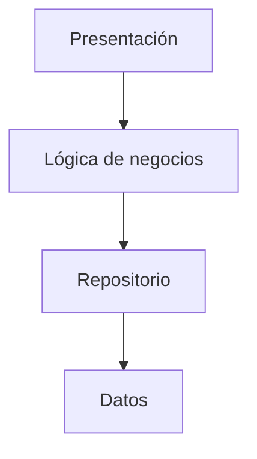
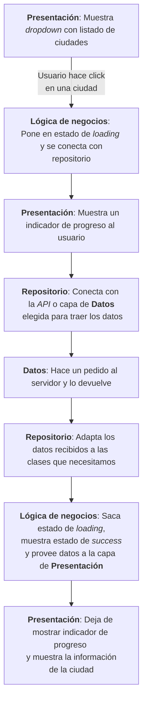

# Introducción a Arquitectura

Supongamos que queremos crear una app que se encarga de pedir un dato por
internet. Estuvimos hablando desde el principio de organización y orden verdad?
Es acaso que en un par de archivos tendremos toda nuestra aplicación? Y será que
tenemos que inventar el cómo hacer toda esta aplicación desde el principio?

Para todo lo anterior, existe la arquitectura de software.

La arquitectura de software __es la estructura y organización de los componentes
de un sistema de software, así como las relaciones y dependencias entre ellos__.
En términos simples, es la forma en que el software está diseñado y organizado
para cumplir con sus requisitos y objetivos.

La importancia de la arquitectura de software radica en que afecta directamente
la calidad y el éxito del mismo. __Una buena arquitectura ayuda a crear un
sistema más eficiente, escalable, fácil de mantener y extensible__. Además,
__permite la detección y corrección temprana de problemas__, __reduce el tiempo
y el costo de desarrollo, y facilita la colaboración y el trabajo en equipo__.

Como estamos por terminar nuestra parte inicial y aprendiendo a interactuar con
el mundo real digital, necesitamos empezar a ordenar la forma en la que
escribimos código y saber que __existen convenciones que nos ayudan a avanzar
mucho más rápido__ en el proceso; hablaremos de dos fundamentales.

## Separación por capas

Algo fundamental es __organizar nuestro código según distintas capas para que
puedan utilizarse como piezas intercambiables__. Es común separar aquello con lo
que el usuario tiene que interactuar (presentación o vista) con la lógica para que
esa vista funcione (lógica de negocio). Luego podemos tener a su vez otra capa
que se encargue de alcanzarle lo necesario a esa lógica, transformándola o
adaptándola (repositorios) y finalmente, la capa que tiene la función de obtener
los datos en bruto y pasárselos a la capa de repositorios (capa de datos).

__Lo interesante__ de la organización en capas es que __separa las diferentes
responsabilidades de la aplicación en partes específicas__ y cohesivas, lo que
hace que sea __más fácil de entender__.

Veamos un ejemplo: tenemos una aplicación que muestra un listado de capitales
del mundo y al hacer click en una de ellas, hace un pedido a un servidor. Éste
responde y dicha respuesta es adaptada a las clases que necesitamos y se acaba
mostrando una serie de datos sobre dicha ciudad.

El que sea más fácil de entender y el que esté estratificado (separado por
capas), __permite que también sea más fácil de mantener ya que si algún error
sucede sabremos de qué capa proviene.__

Por otro lado, __permite una mayor escalabilidad__, lo que significa que la
aplicación puede  __crecer y adaptarse a las necesidades del negocio sin afectar
las otras partes__ de la  aplicación.

Por ejemplo, nuestra gente de _marketing_ podría querer ya no utilizar un
_dropdown_ sino un simple listado, cambio que será muy fácil de realizar debido
a que solamente tenemos que alterar la capa de presentación.

Lo mismo sucedería si nuestros compañeros de _backend_ deciden utilizar otra
_API_ en el proceso de obtención de datos ya que solamente esa capa sería la que
recibiría modificaciones.

Finalmente, separar la aplicación en capas __facilita la colaboración entre
diferentes equipos de desarrollo__, ya que __cada equipo puede trabajar en su propia
capa__ de la aplicación sin interferir en otras capas.

## Patrones de diseño

Los patrones de diseño son __soluciones comunes a problemas recurrentes que se
presentan en el desarrollo__. En general, los patrones de diseño se dividen en
tres categorías: creacionales, estructurales y de comportamiento y hemos visto
ejemplos de cada una de ellas:

- __Patrones de creación__: se utilizan para resolver problemas de creación de
  objetos y para lograr una mayor flexibilidad en la creación de objetos. Hemos
  utilizado y hablado sobre alguno de ellos:
  - _Singleton_: garantiza que solo haya una instancia de una clase en todo el
    programa.
  - _Factory_: cuando vimos constructores.
- __Patrones estructurales__: se enfocan en cómo las clases y los objetos se
  combinan para formar estructuras más grandes.
  - _Decorator_: se utiliza para agregar funcionalidad a un objeto existente sin
    modificar su estructura básica.
- __Patrones de comportamiento__: se concentran en cómo los objetos y las clases
  interactúan y distribuyen la responsabilidad entre ellas. Se utilizan para
  lograr una mayor flexibilidad y extensibilidad en la interacción entre objetos
  y clases.
  - _Extensions_: cuando quisimos agregar funcionalidad a una clase.

Cada categoría de patrones de diseño tiene su propio enfoque y utiliza
diferentes técnicas para resolver diferentes problemas de diseño. __La elección
de un patrón de diseño adecuado dependerá del problema específico que se esté
tratando de resolver y de los requisitos de diseño del sistema en general.__
